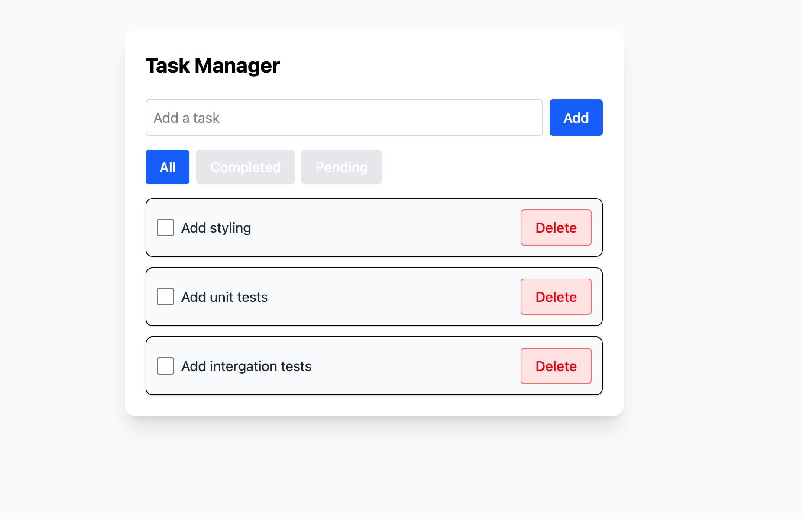
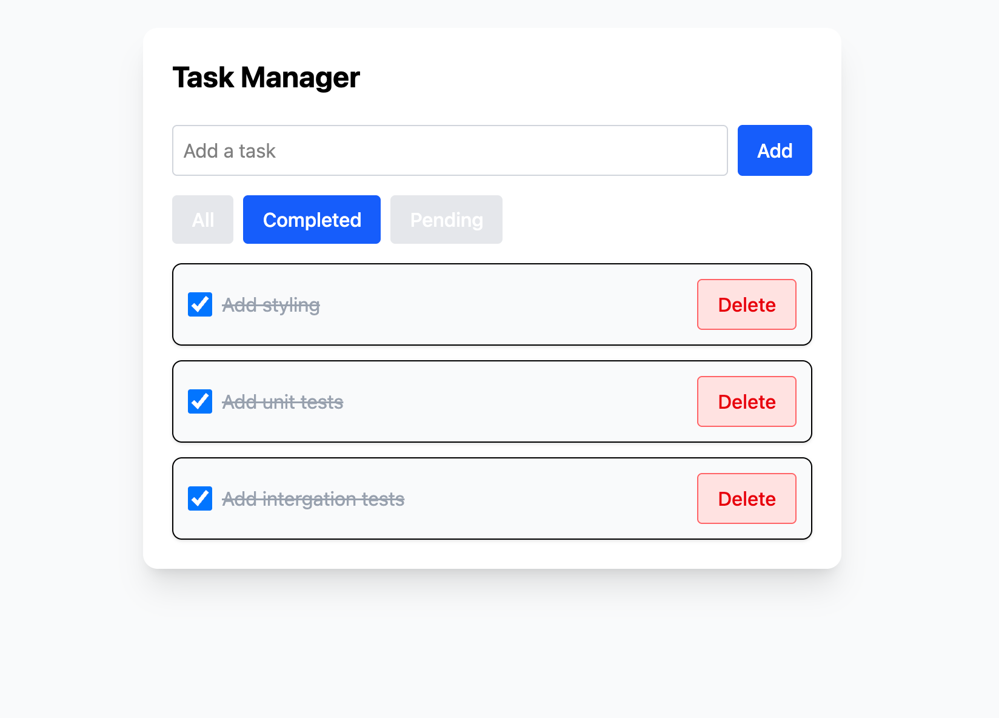

# Task Manager App

This is a simple Task Manager app built with **Vite**, **React**, **TypeScript**, **Tailwind CSS**, **Zustand**, and **Framer Motion**. It allows users to create, filter, and manage tasks locally, simulating realistic loading and optimistic UI patterns.

## 🚀 Features

- Add, complete, and delete tasks
- Filter by "All", "Completed", or "Pending"
- State persisted to `localStorage` via Zustand
- Simulated API delay and error handling
- Motion transitions via Framer Motion
- Fully unit-tested with Vitest and Testing Library

## 🛠️ Tech Stack

- Vite + React + TypeScript
- Tailwind CSS for styling
- Zustand for state management (with `persist` middleware)
- Framer Motion for animation
- Vitest + React Testing Library for unit tests

## 📦 Getting Started

### 1. Clone the repo

```bash
git clone https://github.com/qaalib101/task-manager.git
cd task-manager
```

### 2. Install dependencies

```bash
npm install
```

### 3. Run the app

```bash
npm dev
```

### 4. Run tests

```bash
npm test
```

## 🧠 Design Decisions

### Zustand as the “API”

Rather than relying on a real or mock backend (like JSONPlaceholder), Zustand was treated as both the local state manager and the API layer. This means:

- All state is persisted locally using `zustand/persist`.
- A `fetchData()` method simulates API loading using a delay, even if data already exists.
- Optimistic updates are used for task creation, deletion, and toggling with rollback behavior on simulated failure.

### Mock API Call

A utility `fakeApiCall<T>(data, delay)` simulates network latency and potential failures, allowing realistic UI responses without needing an actual backend.

### Tailwind CSS

Tailwind CSS was used for fast, utility-first styling with responsive design, consistent UI, and minimal custom CSS.

### Accessibility

The UI uses semantic HTML, accessible labels, and keyboard-friendly elements. Additional improvements can include better screen reader support and ARIA labels.

### Framer Motion

Animations are used for mounting/unmounting task items using `AnimatePresence`, giving a polished interactive feel when tasks are added or removed.


## 📸 Screenshots





---

Made with ❤️ using React + Zustand + Framer Motion